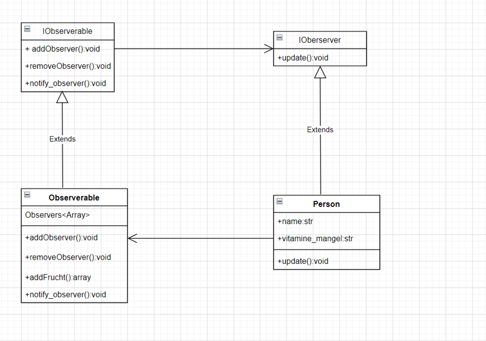

# Vitaminmangel Observer Projekt
Dieses Projekt demonstriert die Verwendung des Observer-Entwurfsmusters zur Überwachung von Personen mit Vitaminmangel, während sie Früchte mit einem bestimmten Vitamin konsumieren. Die Implementierung erfolgt in Python und illustriert die Konzepte von Observers und Observables.


# Funktionsweise
Das Projekt besteht aus zwei Hauptkomponenten: Observers und Observable.

# Observers
Die Observers repräsentieren die Personen mit Vitaminmangel. Jeder Observer hat ein Vitaminmangel. Die Observers werden über Änderungen an den beobachteten Früchten informiert und können entsprechend reagieren, wenn eine Frucht mit einem benötigten Vitamin konsumiert wird.

# Observable
Das Observable ist eine Klasse, die die beobachteten Früchte darstellt. Jede Frucht hat ein bestimmtes Vitaminen, das sie enthält. Wenn eine Frucht konsumiert wird, informiert sie automatisch alle registrierten Observers darüber.

# Installation

Um das Projekt auszuführen, müssen Sie sicherstellen, dass Sie Python auf Ihrem System installiert haben. Klonen Sie dann dieses Repository auf Ihren lokalen Computer.

```sh
git clone https://github.com/FBAgol/Observer-miniProjekt.git
```

on main.py
```

# UML 


